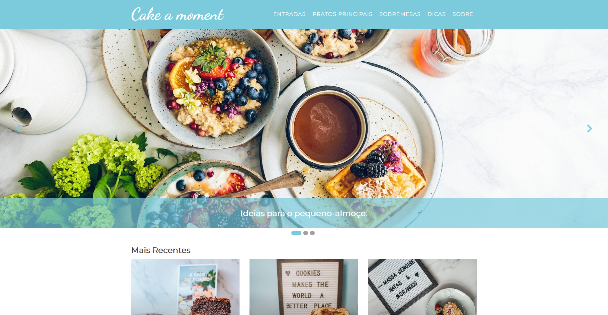

# Getting Started with Cake a moment APP


This project was bootstrapped with [Create React App](https://github.com/facebook/create-react-app).

This project is a recipe website where main dishes and starters are from the Edamam API to get the information. For these recipes, you will be directed to an external page.
Desserts have an array in the document to provide the recipes. In these recipes will open a new page where you can see the recipe and select the ingredients.
The slideshow on the home page will send you to some content in the Tips Page or to a page in construction.
On the recipes pages, you have a search bar.
In the about page there is a form only does the validation. If all the fields are correct, they must show a pop-up.
On the Tips Page, you have some text and a converter.

## Run Locally

Clone the project

```bash
  git clone https://github.com/marianasilva1/flag-project
```

Go to the project directory

```bash
  cd flag-project
```

Install dependencies

```bash
  npm install
```

Start the server

```bash
  npm run start
```

## Environment Variables

The API used is from https://www.edamam.com/
To see all funcionalities of project, you will need to add the following environment variables to your .env file

`API ID`

`API KEY`

## Technologies used in the project

- HTML;
- CSS/Sass;
- JavaScript;
- React.js
